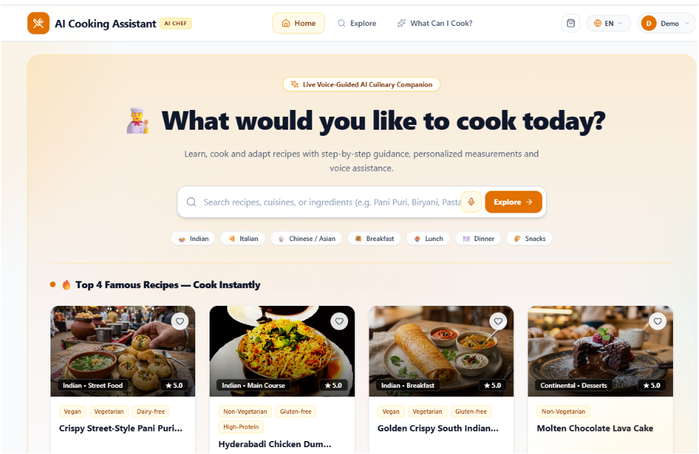

# AI Cooking Assistant

An intelligent AI-powered cooking companion designed to make cooking easier, more personalized, and interactive. It helps users discover recipes, match available ingredients, scale servings, recover from cooking mistakes, and follow step-by-step cooking guidance.

## 📸 Project Preview



## ✨ Key Features

- **🤖 AI-Powered Recipe Assistant** — Generates and recommends recipes based on user preferences and available ingredients.

- **🥕 Smart Pantry Matcher** — Enter ingredients available in your pantry and discover suitable recipes with intelligent ingredient matching and substitution suggestions.

- **👨‍🍳 Cook With Me** — Hands-free, step-by-step cooking mode with voice guidance, step navigation, and interactive timers.

- **⚖️ Smart Serving Scaling** — Automatically adjusts ingredient quantities based on the selected number of servings.

- **🛟 Cooking Mistake Recovery** — Provides practical suggestions and recovery steps when common cooking mistakes occur.

- **🌍 Multilingual Kitchen** — Supports English, Telugu (తెలుగు), Hindi (हिंदी), and Spanish (Español) for a more accessible cooking experience.

- **🍽️ Recipe Discovery** — Explore recipes across different cuisines, categories, dietary preferences, difficulty levels, and cooking times.

- **❤️ Personalized Experience** — Save favorite recipes and maintain personalized cooking preferences.

- **🎯 Demo Mode** — Quickly explore the application's features through a convenient demo experience.

## 🧠 How It Works

```text
User Input
    ↓
Ingredient / Recipe Analysis
    ↓
AI Recipe Recommendation
    ↓
Personalized Recipe
    ↓
Smart Ingredient Scaling
    ↓
Step-by-Step Cooking Guidance
    ↓
Voice-Assisted "Cook With Me"
````

## 🌟 Highlights

* AI-powered recipe recommendations
* Ingredient-aware recipe matching
* Personalized cooking suggestions
* Automatic ingredient scaling
* Voice-guided cooking assistance
* Interactive cooking timers
* Multilingual support
* Cooking mistake recovery
* Recipe discovery and filtering
* Personalized favorites and preferences
* Responsive and modern user interface

## 🛠️ Tech Stack

### Frontend

* React 19
* TypeScript
* Vite
* Tailwind CSS
* Lucide Icons
* Motion

### Backend

* Node.js
* Express
* TypeScript
* tsx

### AI & Interaction

* AI-powered recipe generation
* Web Speech API
* HTML5 Audio
* Multilingual voice assistance

## 🎯 Project Goal

The goal of **AI Cooking Assistant** is to combine **AI, personalization, voice interaction, and practical cooking guidance** into a single easy-to-use culinary companion.

It aims to make recipe discovery and cooking more convenient by adapting to what users have, what they prefer, and how they cook.

## 👩‍💻 Author

**Jasmine**

Built with ❤️ using React, TypeScript, Node.js, and AI.


